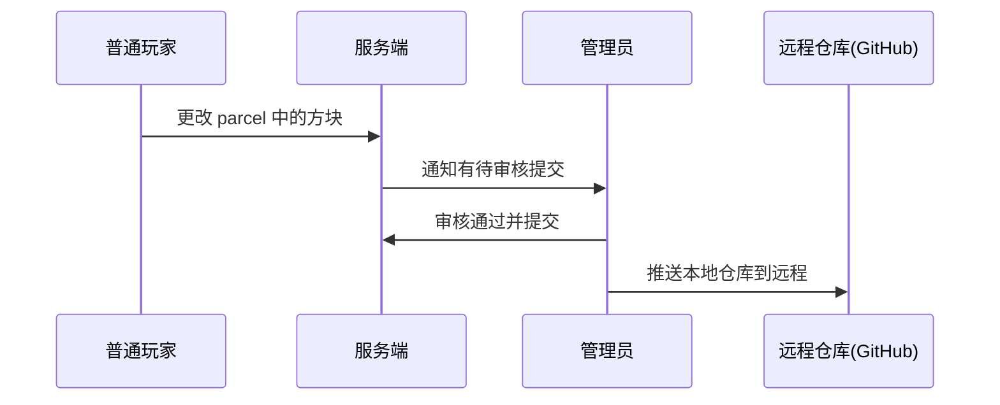

# 身份验证相关机制

前提：

- 本模组的目标是适用于包括单人游戏、本地多人游戏、专用服务器在内的游戏环境
- 为了避免占用过多上行网络资源，要尽可能避免从客户端完整地将parcel传输给服务端

## v0

本地git仓库位于服务端

- 更改远程仓库时，玩家需要在客户端完成身份验证后，向服务端提供token
- 拉取远程仓库时，由服务端直接进行，方便直接加载到世界中

缺点：

- 如果token长期有效，则服务端的恶意 mod 可能获取 token
- 如果token有效期太短，玩家需要频繁操作，不方便

适用场景：

- 本地单人游戏
- 自己架设服务端
- 加入信任的好友架设的服务器

## v1

本地git仓库位于客户端

- 更改远程仓库时，身份认证等操作完全在客户端进行
- 拉取远程仓库时，可以直接拉取到客户端玩家预先设置好的目录

优点：

- 安全
- 身份认证机制较简单

缺点：

- 客户端需要将parcel内容完整地传输给服务端。
  - 服务器的上行带宽通常较为有限，加载较大的 parcel 时可能占用过多网络资源。

适用场景：

- 本地单人游戏
- 加入本地或局域网中的服务器

## ~~v2~~ （太复杂，算了）

当进行多人游戏时，在服务端和客户端分别存一份git仓库，提交操作先在服务端进行，然后仓库中的新提交同步到客户端。

当进行本地单人游戏时，本地git仓库的路径与服务端相同，也就是只存一份，不进行“将服务端的新提交同步到客户端”的操作。

玩家在客户端完成身份认证，不需要将token传输给服务端。

当玩家想将新提交推送到远程仓库时，先在本地仓库推送，然后告知服务端重新 fetch

## v3

本地git仓库位于服务端，由服务器管理员专门管理。

具有管理员权限的玩家可以：

- 管理本地git仓库
  - 身份认证
  - 设置其他玩家在此仓库的权限
  - 推送到远程仓库
- **管理 parcel**
  - 设置 parcel 与本地仓库的对应关系（哪个 parcel 属于哪个仓库/分支，以及在仓库中的路径）
  - 审核玩家提交的 parcel（可配置自动审核或手动审核）
  - 设置 parcel 的可见性（公开/私有/仅特定玩家组可见）

### 工作流程

### 优点

| 优势               | 说明                                                    |
| ------------------ | ------------------------------------------------------- |
| **安全性高**       | 认证凭证仅由管理员持有，普通玩家无法获取 token          |
| **网络效率高**     | 客户端无需与远程仓库直接通信，所有 git 操作由服务端完成 |
| **集中管理**       | 服务器可统一审核内容，避免恶意/违规 parcel 传播         |
| **权限灵活**       | 可针对不同玩家/玩家组设置不同的仓库/parcel 访问权限     |
| **适合公共服务器** |                                                         |

### 缺点

| 劣势           | 说明                                                                       |
| -------------- | -------------------------------------------------------------------------- |
| **依赖管理员** | 在公共服务器上，普通玩家无法直接推送自己的作品到远程仓库，需管理员代为操作 |
| **单点故障**   | 如果管理员不活跃，仓库可能长期不更新                                       |

### 适用场景

- 公共服务器
- 本地单人游戏

## 方案对比总结

| 特性       | v0     | v1     | v3     |
| ---------- | ------ | ------ | ------ |
| 仓库位置   | 服务端 | 客户端 | 服务端 |
| 认证主体   | 玩家   | 玩家   | 管理员 |
| 网络效率   | 高     | 低     | 高     |
| 安全性     | 中     | 高     | 高     |
| 适合公共服 | ❌     | ❌     | ✅     |
| 适合单人   | ✅     | ✅     | ✅     |
