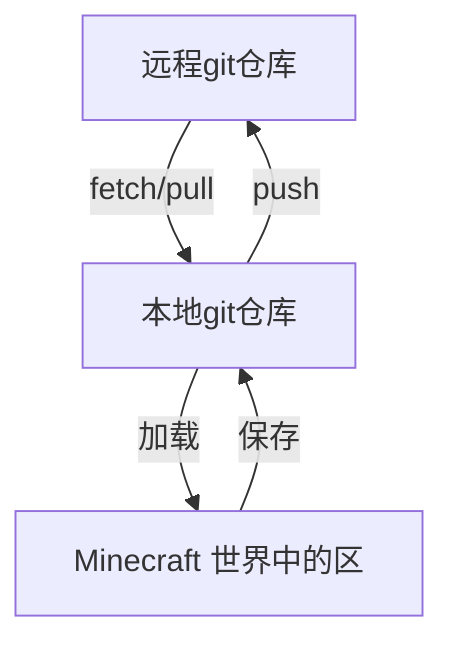

# Git Parcel

大致功能：

- 使用git管理世界中的特定长方体区域（区）中的方块、实体等数据
  - 历史回溯，每做一些更改，你可以将更改提交到git仓库，之后可以随时回溯到任一历史提交
  - 可以push到github上的远程git仓库，从而实现：
    - 云端同步，可以在另一台电脑/服务器上继续建造
    - 分享给其他人，别人只需要知道相应链接就可以将其加载到世界中
- 根据条件搜索其他玩家分享的区
- 从远程仓库拉取**区**到本地，并将其放置到你的世界中的特定位置

## 核心工作机制

本模组定义了一个概念“区”（Parcel），它是一个长方体形状的，具有特定尺寸的 Minecraft 世界：

- 你可以将世界中的某个长方体区域看作一个“区”，并将其保存到磁盘中指定路径
- 存储在磁盘中的“区”与特定存档、维度或世界中的位置无关,，它可以被加载到任意世界中的任意指定位置

### 区的格式

“区”以自定义格式存储，或许可以有几种不同格式，分别针对玩家的不同需求：

| 格式                   | 特点                           |
| ---------------------- | ------------------------------ |
| 类似原版结构方块的格式 | ~~体积小~~体积大，没啥用       |
| 纯文本的自定义格式     | 体积适中，但可高效进行增量更新 |

自定义格式有以下特征：

- 适合使用git管理
  - 一个区中的数据存储在一个目录中，该目录下可以包含多个文件
  - 按行存储，修改区中部分内容时尽量不改动其他部分
  - 总体积尽量小
  - 目录下的文件数量不能太多（通常不超过256)
  - 每个文件不能过大（200KB以内）
  - 应当便于git进行增量编码，从而尽量减小仓库总体积
  - 其中文件可以是纯文本格式，也可以是二进制格式（git可为二进制文件使用增量编码）
- 区的目录中有一个名称固定（名称待定）的元数据文件，以便检索
  - 区的元数据中包含一些关键信息，例如MC版本、格式版本、区的名称、描述等

### 搜索和索引机制

- 咱在github有一个专门的索引仓库，存储大家上传的作品的索引。这个索引仓库中存储的作品的来源包括：
  - 我使用脚本自动定期从github爬取
  - 由玩家主动在索引仓库提PR申请收录
- 可以收录github以外来源的作品，如gitlab, gitee等
- 模组中提供交互界面，玩家只需粘贴某个作品的链接，就可以将它下载到本地的库存中（位置可由玩家自定义），并加载到世界中的某个位置
- 用于存储区的github仓库应当遵循一些规范
  - 一个git仓库可以包含多个区
  - 在仓库的根目录有一个标志性的工作区元数据文件，其中存储着仓库中的所有区域的路径
  - 仓库应当设置一个特殊的topic（名称待定），这样才能被我的脚本搜索到

自动更新索引的脚本：

- 跳过由玩家主动申请收录的仓库
- 脚本会读取仓库中的元数据文件
- 索引仓库有审核机制，包括AI审核、人工审核、社区举报等
- 索引仓库中会记录玩家作品的审核状态
- 本项目提供一个静态网站（随索引仓库自动更新），用户可以在这里搜索已被索引的作品，然后复制其URL

## 可行性

是否真的能设计出一种足够高效的存储格式，既能满足上述要求，又能将空间占用压缩到可接受的范围内？

计划：

1. 设计并实现几种格式的存储功能
2. 找一些值得被记录的“区”，这些区要满足以下条件：
   - 挑那些最可能被玩家保存的内容
   - 包含各种尺寸（最大的要超过结构方块的大小）
   - 包含各种类型的内容（方块、实体、实体方块等，可以包含各种数据）
3. 统计这些不同的区的存储效率，包括速度、空间占用

经过验证，我初步实现的一种纯文本格式的存储空间占用已经优于原版结构方块存储结构的格式

## Q&A

### 为什么用 Git

- 可以复用 Git/GitHub 生态
  - 可以记录建造的过程，能随时回溯到任意一个历史提交
  - 可以由多个玩家分别同时建造一个Parcel的不同部分，分别提交后合并

### 咱普通玩家懒得了解Git怎么办？

- 本模组提供两种使用方式：
  - 将关键功能封装成游戏中简单直观的交互界面，玩家不需要额外学习Git，也能使用基本功能
  - 玩家也可以在本地的存储库中使用git命令，能使用git的完整功能

### 如何处理模组内容？

- 在区的元数据中有一个字段声明允许哪些模组的内容出现，未声明的方块、实体不会被记录。该字段还可以为每个模组指定一个版本范围，意思是如果游戏中该模组的版本在该范围外，则不能正确记录该模组的内容，且很可能无法正常加载。

### 能否调整区的大小？

- 创建区后仍然可以调整区的大小，3个维度的正负两个方向都可以调整。
- 调整大小可能需要改变区中所有物体的数据，因为物体相对于区的某个顶点的坐标是与物体数据在文件中的位置一一对应的
- ~~调整大小不需要改变区中所有物体的坐标，因为存储的物体坐标不是相对于区的某个顶点的，而是相对于枢轴点（Pivot point），枢轴点的坐标是通过区的一个特定顶点确定的，枢轴点可以任意移动、旋转、镜像。~~

### 为什么选择“一仓库多区”而不是“一仓库一区”？

- 便于集中管理：对于包含多个关卡的游戏地图、系列建筑作品集，将所有**区**放在同一个仓库中，可以通过一份元数据文件统一索引，克隆一次即可获取全部内容，避免了维护数十个独立小仓库的碎片化困扰。

### 我只想要某大仓库中的某个小区，也要完整下载整个仓库吗？

不必。

- Git 支持稀疏检出（Sparse Checkout）功能。用户可以只下载自己需要的特定区的目录，无需拉取全量历史。所以如果你只是想下载某个区来瞅瞅，本模组可以仅下载特定的区和必要的元数据文件。

### 如何分享

发布到github，为仓库设置特定topic（待定），我的脚本会自动搜索并加入索引。

有AI审核、人工审核与社区举报机制，会封禁恶意用户或仓库

### 为什么不自建服务器来存玩家的作品？

- 自建服务器的可靠性难以取得玩家信任
- Github 和 Minecraft 都是微软的，可靠性刚好足够
